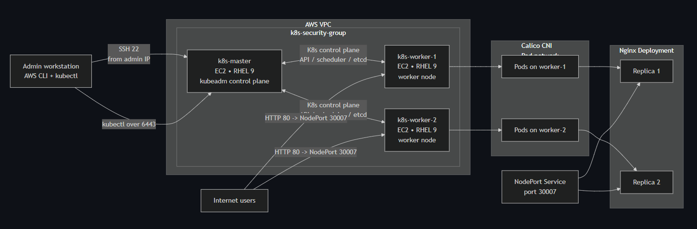

# Kubernetes Homelab (RHEL 9 + kubeadm)

## 🧰 Tech Stack

A fully deployed Kubernetes cluster built on AWS EC2 using RHEL 9 nodes, kubeadm, Calico CNI, and an Nginx application exposed via NodePort.  
This project demonstrates real-world cluster provisioning, networking, container orchestration, and application deployment.

---

## 📌 Architecture Diagram

---

## 🚀 Project Overview

This homelab project provisions a Kubernetes cluster using:

- **AWS EC2** (1 master, 2 workers)
- **RHEL 9** on all nodes
- **kubeadm** for cluster initialization
- **Calico CNI** for networking
- **Docker / containerd** as runtime
- **Nginx Deployment** with 2 replicas
- **NodePort Service** for external access

The goal is to simulate a production‑style Kubernetes environment using real cloud infrastructure.

---

## 🏗️ Cluster Components

### **Control Plane**
- kube-apiserver  
- kube-scheduler  
- kube-controller-manager  
- etcd  
- kubelet  
- containerd  

### **Worker Nodes**
- kubelet  
- kube-proxy  
- containerd  
- Calico CNI  
- Pod networking  

### **Application Layer**
- Nginx Deployment (2 replicas)  
- NodePort Service (30007 → 80)  

---

## 📦 Deployment Steps (High-Level)

1. Provision 3 EC2 instances (RHEL 9)
2. Install Docker + containerd
3. Install kubeadm, kubelet, kubectl
4. Initialize control plane
5. Join worker nodes
6. Install Calico CNI
7. Deploy Nginx
8. Expose via NodePort
9. Access app via public IP + port 30007

Full detailed steps are available in: [docs/full-lab-guide.md](docs/full-lab-guide.md)

---

## 🧪 Validation

- `kubectl get nodes` → all nodes Ready  
- `kubectl get pods -A` → Calico + Nginx running  
- `curl http://<node-public-ip>:30007` → Nginx reachable  
- Calico pod networking verified across nodes  

---

## 🧠 Skills Demonstrated

- Linux server provisioning  
- Kubernetes cluster administration  
- AWS EC2 networking + security groups  
- Container runtime configuration  
- CNI networking (Calico)  
- YAML manifests (Deployment + Service)  
- Troubleshooting cluster components  
- GitHub documentation + architecture diagrams  

---

## 📚 Documentation

Full step-by-step guide:

👉 [docs/full-lab-guide.md](docs/full-lab-guide.md)

---

## ✅ Status

Cluster deployed successfully.  
Nginx application reachable externally via NodePort.  
All nodes healthy and Ready.

