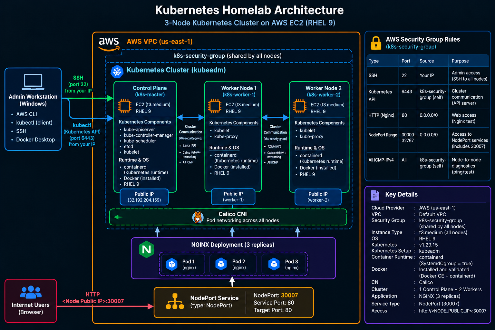

# Kubernetes Homelab (RHEL 9 + kubeadm)

## 🧰 Tech Stack


A three-node Kubernetes cluster built on AWS EC2 using RHEL 9, kubeadm, containerd, and Calico CNI, with an NGINX application deployed across three replicas and exposed externally through a NodePort service.

This project demonstrates Linux system preparation, Kubernetes cluster administration, container runtime configuration, pod networking, AWS networking and security groups, application deployment, and cluster validation.

---

## 📌 Architecture Diagram



---

## 🚀 Project Overview

The Kubernetes homelab consists of:

- **3 AWS EC2 t3.medium instances**
  - 1 control plane (`k8s-master`)
  - 2 worker nodes (`k8s-worker-1`, `k8s-worker-2`)
- **RHEL 9** on all nodes
- **kubeadm** for Kubernetes cluster initialization
- **kubelet** and **kubectl**
- **Docker** installed and validated on all nodes
- **containerd** configured as the Kubernetes container runtime
- **Calico CNI** for pod networking
- **NGINX Deployment** with 3 replicas
- **NodePort Service** exposing NGINX on port `30007`

---

## 🏗️ Cluster Components

### Control Plane

The `k8s-master` node runs the Kubernetes control-plane components:

- kube-apiserver
- kube-scheduler
- kube-controller-manager
- etcd
- kubelet
- containerd

The cluster was initialized with:

```bash
sudo kubeadm init --pod-network-cidr=192.168.0.0/16
```

containerd was configured with:

```text
SystemdCgroup = true
```

### Worker Nodes

Both RHEL 9 worker nodes were joined to the cluster using the `kubeadm join` command generated by the control plane.

Worker-node components include:

- kubelet
- kube-proxy
- containerd
- Calico networking
- Application pods

All three nodes were successfully verified in `Ready` state.

---

## 🌐 Networking & Security

All three AWS EC2 instances shared the `k8s-security-group`.

Configured inbound access included:

| Traffic | Port | Source | Purpose |
|---|---:|---|---|
| SSH | 22 | Administrator IP | Remote administration |
| Kubernetes API | 6443 | `k8s-security-group` | Cluster communication |
| HTTP | 80 | `0.0.0.0/0` | NGINX testing |
| NodePort | 30000–32767 | `0.0.0.0/0` | External NodePort access |
| ICMP | All | `k8s-security-group` | Node-to-node connectivity testing |

The RHEL nodes were also prepared with the Linux networking configuration required for the Kubernetes lab, including:

- `overlay` kernel module
- `br_netfilter` kernel module
- IPv4 forwarding
- Bridge traffic processing through iptables
- Swap disabled

The configuration included:

```text
net.bridge.bridge-nf-call-iptables = 1
net.bridge.bridge-nf-call-ip6tables = 1
net.ipv4.ip_forward = 1
```

---

## 🐳 Container Runtime

Docker was installed and validated on all three RHEL 9 nodes.

Validation included:

```bash
docker version
docker run hello-world
```

Docker was therefore available on the nodes, while **containerd was configured as the Kubernetes container runtime**.

For Kubernetes compatibility, containerd was configured with:

```text
SystemdCgroup = true
```

---

## ☸️ Kubernetes Cluster Initialization

Kubernetes components were installed on the nodes:

- `kubeadm`
- `kubelet`
- `kubectl`

The control plane was initialized using:

```bash
sudo kubeadm init --pod-network-cidr=192.168.0.0/16
```

`kubectl` was then configured for the administrative user using the generated Kubernetes `admin.conf`.

The worker nodes were joined to the cluster using the `kubeadm join` command generated by the control plane.

The cluster ultimately consisted of:

```text
k8s-master      Ready    control-plane
k8s-worker-1    Ready
k8s-worker-2    Ready
```

The deployed nodes were verified running Kubernetes `v1.29.15`.

---

## 🔗 Calico CNI

Calico was installed after control-plane initialization to provide Kubernetes pod networking.

```bash
kubectl apply -f https://docs.projectcalico.org/manifests/calico.yaml
```

Calico provided pod networking across the three-node cluster and allowed the nodes to transition into a functional `Ready` state.

---

## 🌐 NGINX Application Deployment

The application layer consists of an NGINX Kubernetes Deployment configured with **3 replicas**.

The Deployment configuration includes:

```yaml
spec:
  replicas: 3
```

The application was deployed using the repository's Kubernetes manifests:

```bash
kubectl apply -f deployment.yaml
kubectl apply -f service.yaml
```

The NGINX Service uses the following configuration:

```text
Service Type: NodePort
Service Port: 80
Target Port: 80
NodePort: 30007
```

The application was accessible through a node's public IP:

```text
http://<NODE_PUBLIC_IP>:30007
```

---

## 📦 Deployment Steps

1. Configured AWS IAM permissions and AWS CLI access
2. Provisioned 3 AWS EC2 `t3.medium` instances running RHEL 9
3. Configured SSH key-based access and node hostnames
4. Prepared all RHEL 9 nodes for Kubernetes
   - Updated system packages
   - Installed required utilities
   - Disabled swap
   - Enabled `overlay` and `br_netfilter`
   - Configured required sysctl networking settings
5. Installed and validated Docker on all nodes
6. Installed `kubeadm`, `kubelet`, and `kubectl`
7. Configured containerd for Kubernetes
8. Enabled `SystemdCgroup = true`
9. Initialized the Kubernetes control plane with kubeadm
10. Configured `kubectl` access on the control plane
11. Installed Calico CNI for pod networking
12. Prepared and joined both worker nodes to the cluster
13. Verified all 3 nodes reached `Ready` state
14. Created the NGINX Deployment and NodePort Service manifests
15. Deployed the 3-replica NGINX application using `deployment.yaml`
16. Exposed NGINX using `service.yaml` and NodePort `30007`
17. Validated the Kubernetes resources and external application access
18. Pushed the completed project and documentation to GitHub
19. Terminated the EC2 lab instances after project completion

For the complete implementation procedure, see the [Full Lab Guide](docs/full-lab-guide.md).

---

## 🧪 Validation

The completed environment was validated by confirming:

- Docker was installed and operational on the nodes
- `docker run hello-world` completed successfully
- containerd was configured with `SystemdCgroup = true`
- All 3 Kubernetes nodes reached `Ready` state
- The control plane and workers were running Kubernetes `v1.29.15`
- Calico pod networking was operational
- The NGINX Deployment was successfully applied
- NGINX was configured with 3 replicas
- The NodePort Service exposed the application on port `30007`
- The NGINX application was successfully accessible from a browser using a node's public IP

Key validation commands included:

```bash
docker version
docker run hello-world
kubectl get nodes
kubectl get pods
kubectl get svc
```

Successful cluster validation showed:

```text
k8s-master      Ready    control-plane
k8s-worker-1    Ready
k8s-worker-2    Ready
```

The NodePort service exposed NGINX as:

```text
80:30007/TCP
```

External application access was validated using:

```text
http://<NODE_PUBLIC_IP>:30007
```

---

## 🧠 Skills Demonstrated

- RHEL 9 Linux administration
- AWS EC2 provisioning and configuration
- AWS IAM and AWS CLI configuration
- AWS security group configuration
- SSH key-based Linux administration
- Linux package and service management
- Linux kernel module configuration
- Linux networking and sysctl configuration
- Docker installation and validation
- containerd runtime configuration
- Kubernetes cluster deployment with kubeadm
- Kubernetes control-plane administration
- Kubernetes worker-node configuration
- Kubernetes node joining and cluster validation
- Calico CNI and pod networking
- Kubernetes Deployments
- Kubernetes Services
- YAML manifest management
- NodePort service configuration
- Application deployment and validation
- Kubernetes troubleshooting
- Git and GitHub version control
- Technical documentation
- Infrastructure architecture documentation

---

## 📚 Documentation

Detailed project documentation and Kubernetes manifests are available in this repository:

- **[Full Lab Guide](docs/full-lab-guide.md)** — complete step-by-step implementation of the Kubernetes homelab
- **[deployment.yaml](deployment.yaml)** — NGINX Kubernetes Deployment configured with 3 replicas
- **[service.yaml](service.yaml)** — NodePort Service exposing NGINX through port `30007`
- **Architecture Diagram** — visual representation of the AWS EC2, Kubernetes, container runtime, Calico, NGINX, security group, and NodePort architecture shown above

The Full Lab Guide documents the implementation from AWS configuration and EC2 provisioning through RHEL preparation, Docker and containerd configuration, Kubernetes cluster creation, Calico networking, worker-node joining, NGINX deployment, validation, GitHub documentation, and lab cleanup.

---

## ✅ Status

**Project completed successfully.**

- 3-node Kubernetes cluster deployed on AWS EC2
- 1 control plane and 2 worker nodes configured
- All nodes reached `Ready` state
- Kubernetes `v1.29.15` validated across the cluster
- Docker installed and validated on the nodes
- containerd configured as the Kubernetes runtime
- Calico CNI configured for pod networking
- NGINX deployed with 3 replicas
- NodePort `30007` configured and externally validated
- Project source and documentation pushed to GitHub
- EC2 lab instances terminated after project completion


